# MoviesApp

A Flutter movie application for the ITI graduation project. Users can browse and search movies, view movie details, and save movies in personal lists.

## Features

- Register, log in, and log out with Firebase Authentication.
- Browse Popular, Now Playing, Top Rated, and Upcoming movies from TMDB.
- Search movies and view their details.
- Add and remove movies from Favorites, Watched, Watching, and Want to Watch.
- Save lists in SQLite so they remain after the app restarts.

## Technologies

Flutter and Dart, Provider, TMDB API, Firebase Authentication, and SQLite (`sqflite`).

## Architecture and state management

The app uses a simple Provider and service structure. Provider was chosen because it is easy to follow for this app's size. Screens display data and call providers; providers manage loading, results, errors, and saved-list state; services handle TMDB, Firebase Authentication, and SQLite. Movie responses are converted into the `Movie` model before they reach the screens.

- `lib/screens/`: app screens.
- `lib/widgets/`: reusable UI widgets.
- `lib/providers/`: authentication, movie, and list state.
- `lib/services/`: TMDB, Firebase Authentication, and database code.
- `lib/models/`: movie and list data models.

## TMDB API

`TmdbService` requests the Popular, Now Playing, Top Rated, and Upcoming movie lists, searches movies by title, and loads details for a selected movie. `Movie.fromJson` converts the API response into the app's movie model. The app shows loading, error, and empty-result messages.

## Firebase Authentication

`AuthService` uses Firebase Authentication for email/password registration, login, and logout. `AuthProvider` manages the authentication loading and error states. The app listens to Firebase's authentication state to show the login screen or the signed-in app.

## Setup and run

Before running, open `lib/services/tmdb_service.dart` and replace `YOUR_TMDB_API_KEY` with your TMDB API key.

From the project folder, run:

```bash
flutter pub get
flutter run
```

Firebase is configured for this project. Email/password sign-in must be enabled in the Firebase project.

## Database

SQLite stores the four movie lists on the device. Each saved movie is associated with the signed-in user's Firebase ID. Lists persist after restarting the app, but do not sync between devices.

## Screenshots

| Login | Registration | Home |
|---|---|---|
| 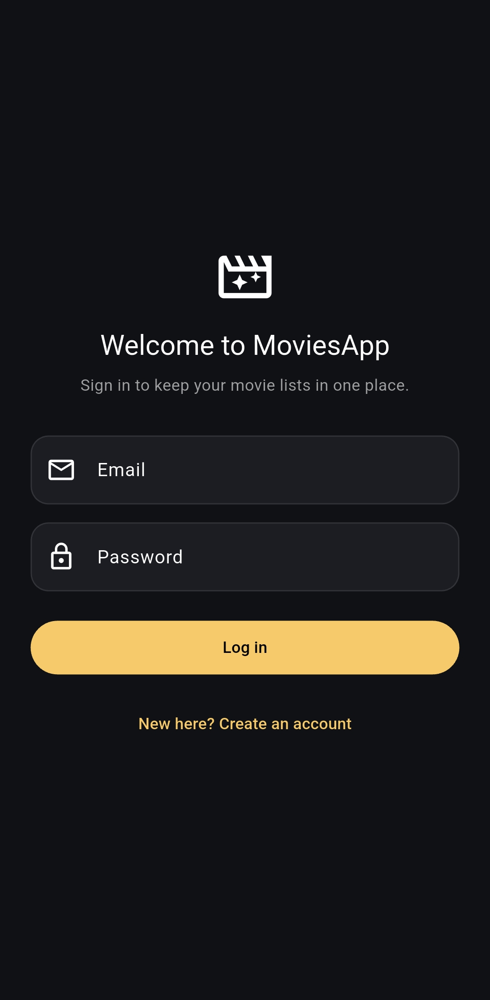 | 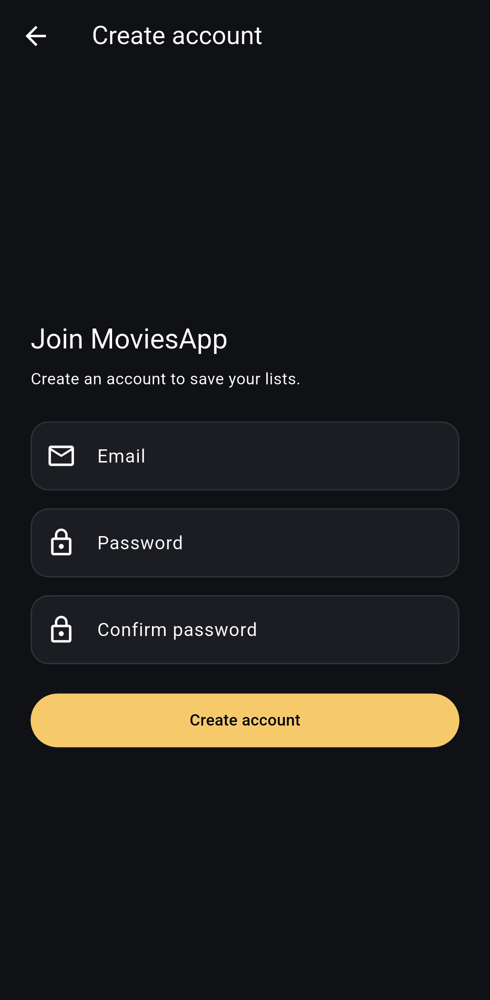 | 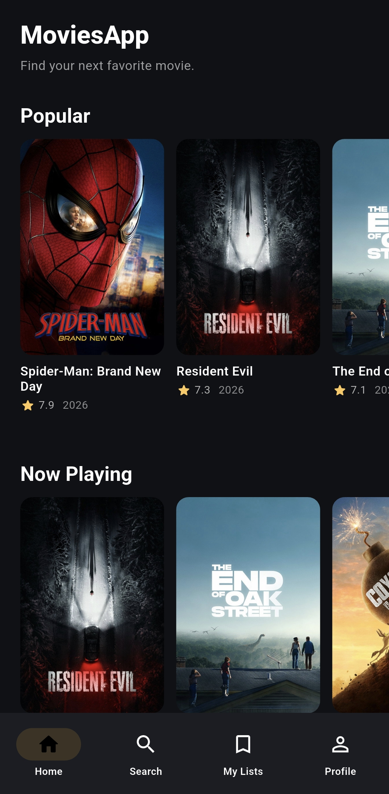 |

| Home categories | Search | Movie details |
|---|---|---|
| 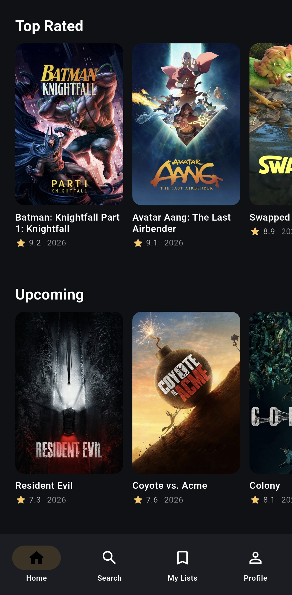 | 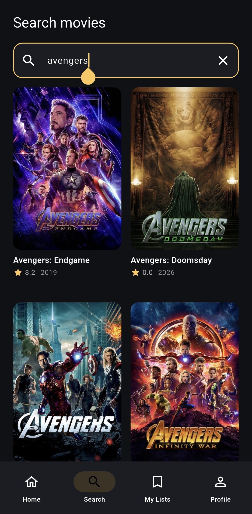 | 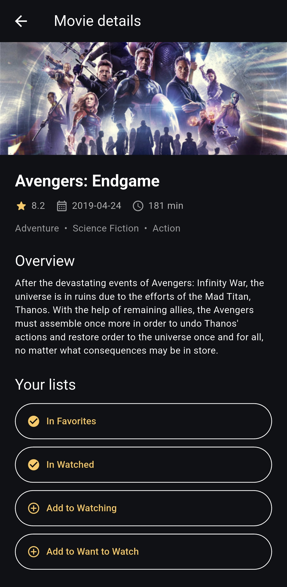 |

| Favorites | Watched | Watching |
|---|---|---|
| 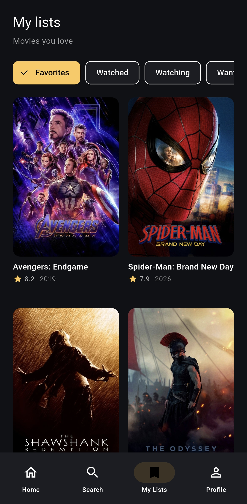 | 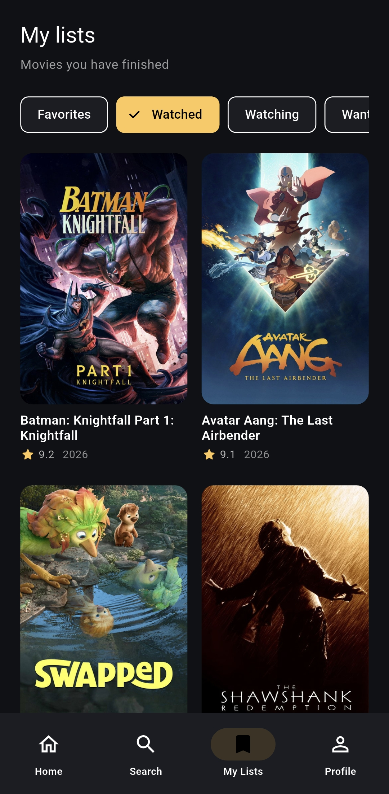 | 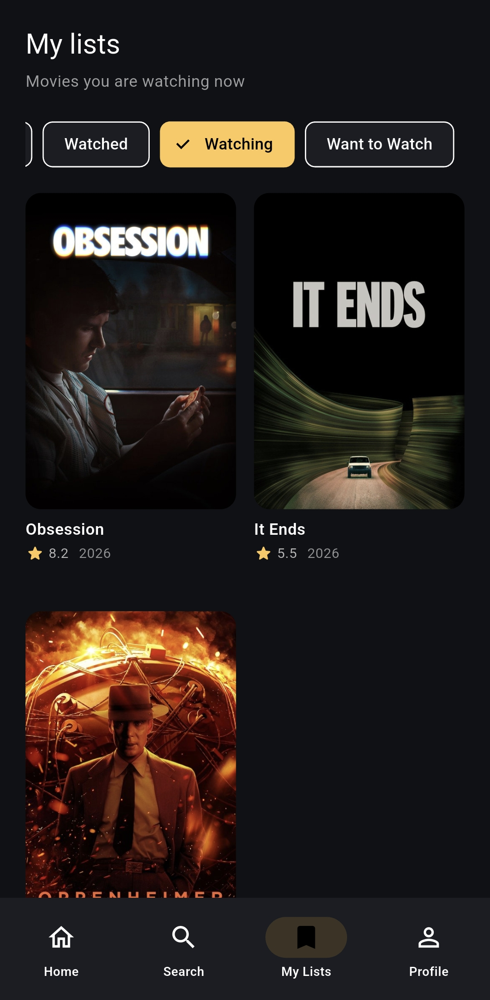 |

| Want to Watch | Profile | |
|---|---|---|
| 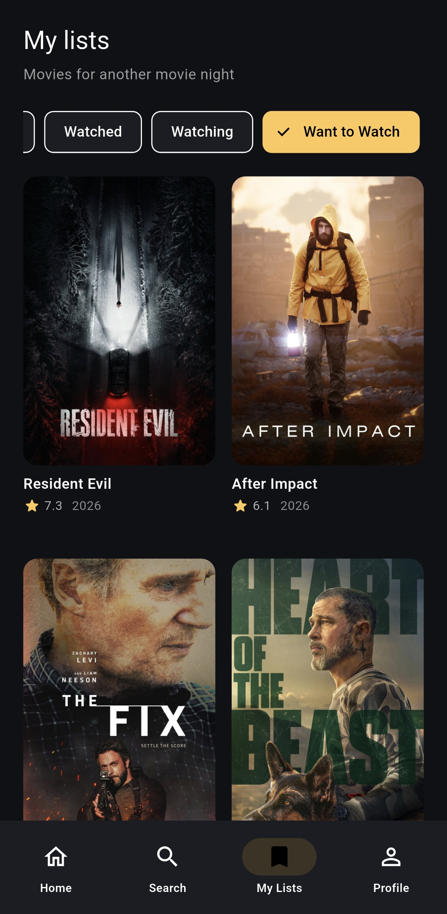 | 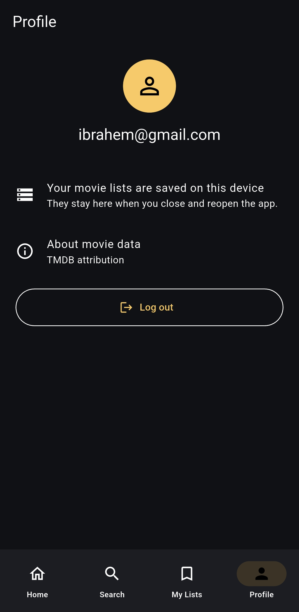 | |

## Known limitation

Saved lists are local to the device and do not sync to other devices.
